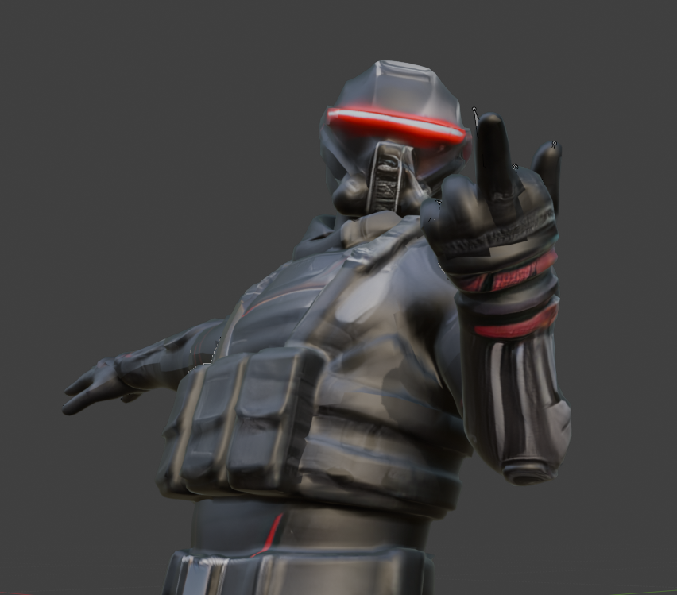

<div align="center">

# riggs

### _"I'm gettin' too old for this shit."_

**Auto-rig and auto-weight any humanoid mesh into a poseable, game-ready skeleton, driven by your AI agent.**

No manual bone placement. No weight painting. No fighting Mixamo's web UI. One command, a mesh goes in, a clean rigged FBX comes out.



</div>

---

## What it does

You have a humanoid mesh (generated, sculpted, scanned, whatever). riggs turns it into a fully
rigged, fully skinned, animation-ready character, running the heavy ML rigging on a cheap rented
cloud GPU so you do not need a beefy local card. The result is a Mixamo/UE-Mannequin skeleton with
clean weights that you can pose immediately and drop into Unreal Engine.

It is built to be driven by an **AI coding agent** (Claude Code), so you can literally say
"rig this mesh" and it happens. There is also a plain CLI if you prefer to drive it yourself.

## Why

Rigging a generated mesh has always been the wall. The usual failure is trying to get a vision
model to eyeball bone positions onto a mesh, which fights every tool in the stack and is miserable
to verify. riggs takes a different path:

1. **An ML auto-rigger reads the geometry** and places the skeleton + skin weights end to end. It
   sees the actual mesh instead of assuming a pose, so it fixes the classic "A-pose mesh vs T-pose
   skeleton" mismatch on its own.
2. **A `bpy` validation layer** turns "does this rig look right?" into discrete, structured pass/fail
   checks (every bone has a vertex group, no unweighted verts, weights sum to 1.0, single root,
   symmetry). The agent reads those instead of guessing.

## Quick start

```bash
git clone <your-fork-url> riggs && cd riggs
cp .env.example .env          # add your RunPod + Hugging Face keys (see below)
pip install -r requirements.txt
```

Rig the **bundled Guard** on a cloud GPU:

```bash
cd cloud/runpod
python rp.py rig --engine mia \
    --input  ../../examples/Guard_base.glb \
    --output ../../examples/Guard_rigged.fbx
```

That single command spins up a GPU pod, provisions the rigger, rigs the mesh, pulls the FBX back,
and tears the pod down. First run is ~15-20 min (it installs the engine + downloads weights);
roughly **$0.10** of GPU time. `examples/Guard_UE.fbx` is the pre-rigged result if you just want to
see the output without spending anything.

### Keys you need (`.env`)
| Key | What | Where |
|-----|------|-------|
| `RUNPOD_API_KEY` | rents the GPU | https://www.runpod.io/console/user/settings |
| `HF_ACCESS_TOKEN` | downloads the gated model/data below | https://huggingface.co/settings/tokens (read scope) |

### Hugging Face gated access (the one thing that trips people up)
A token alone is **not enough** for rigging: you must also click **"Agree / Request access"** once on the Mixamo dataset page, logged in with the same account your token belongs to, or downloads 403 mid-run.

| Accept this repo | Needed for | Notes |
|---|---|---|
| [datasets/jasongzy/Mixamo](https://huggingface.co/datasets/jasongzy/Mixamo) | **Rigging** (MIA loads the Mixamo bone templates) | Usually granted instantly on agreeing. Output rig is yours. |

**Animation needs no extra acceptance.** Kimodo's text encoder is Llama-3-8B, which Meta gates behind a manual-review queue — but Llama 3's Community License permits redistribution, so riggs pulls a license-compliant non-gated mirror automatically (`setup_text_encoder.py`). You only need the HF token, no waiting on Meta.

## Drive it with your Claude Code agent

riggs ships a **skill** (`.claude/skills/runpod-rig/`) that Claude Code auto-discovers in this repo.
Once your `.env` is set, just talk to your agent:

> **"Rig examples/Guard_base.glb on RunPod and pull the result back."**

> **"Spin up an RTX 3090 pod, rig this mesh, then terminate it."**

> **"What RunPod GPUs are cheapest right now?"**

The agent invokes the skill, runs the right `rp.py` commands, watches the job, and hands you the
rigged FBX. It knows the gotchas (gated dataset, scale, SSH) because they are baked into the skill
and the provisioning scripts.

Want it available everywhere, not just this repo? Copy `.claude/skills/runpod-rig/` into
`~/.claude/skills/` for a global skill.

## How the cloud setup works

The whole thing is a thin control layer over RunPod. `cloud/runpod/rp.py` is the CLI:

```bash
python rp.py gpus                      # list GPU types, sorted by price
python rp.py up --gpu "NVIDIA GeForce RTX 3090"   # create a pod, print its SSH
python rp.py status <pod_id>           # state + connection
python rp.py exec   <pod_id> -- nvidia-smi
python rp.py push   <pod_id> local.glb /opt/riggs/in.glb
python rp.py pull   <pod_id> /opt/riggs/out.fbx out.fbx
python rp.py stop   <pod_id>           # pause GPU billing
python rp.py resume <pod_id>
python rp.py down   <pod_id>           # terminate
python rp.py rig --engine mia --input mesh.glb --output rigged.fbx   # the one-shot
```

It authenticates with just your `RUNPOD_API_KEY`, generates an SSH keypair, injects the public key
into the pod via the `PUBLIC_KEY` env var (no dashboard step), provisions a stock GPU pod at runtime
(no registry or local Docker build required), runs the rig, and retrieves the file.

### Engines
| Engine | License | Skeleton | Skin weights | GPU | Use |
|--------|---------|----------|--------------|-----|-----|
| **MIA** ([Make-It-Animatable](https://github.com/jasongzy/Make-It-Animatable)) | code MIT, weights Apache-2.0 | Mixamo | yes | any CUDA | **default**, commercial-OK, full rig |
| **UniRig** ([VAST-AI](https://github.com/VAST-AI-Research/UniRig)) | MIT | own topology | not yet released | sm_75+ | skeleton-only today, for the bake-off |

MIA is the one that produces a complete, commercially usable rig right now. Its output rig is yours.

## Validate and preview locally (free, no GPU)

The `bpy` tools run in your local Blender (found automatically, or set `RIGGS_BLENDER`):

```bash
# structured rig validation
python src/riggs/blender_runner.py src/riggs/bpy_scripts/analyze.py '{"file": "examples/Guard_UE.fbx"}'
# bone-overlay render (front/side)
python src/riggs/blender_runner.py src/riggs/bpy_scripts/render.py '{"file": "examples/Guard_UE.fbx", "out_dir": "out", "show_bones": true}'
# convert a Mixamo-rigged FBX -> UE Mannequin names + ik_ bones, UE-ready export
python src/riggs/blender_runner.py src/riggs/bpy_scripts/canonicalize_ue5.py '{"file": "in.fbx", "output": "out_UE.fbx"}'
```

## Getting it into Unreal Engine

`canonicalize_ue5.py` renames the Mixamo skeleton to the UE Mannequin convention (`pelvis`,
`spine_01..03`, `upperarm_l`, etc.), adds the `root` and `ik_` bones UE expects, normalizes weights,
and exports a UE-ready FBX.

> ### ⚠️ The FBX scale + orientation gotcha (read this before you import)
> Mixamo/MIA output (and therefore the exported FBX) is **Y-up and in meters**. This is a standard
> FBX, and Unreal's importer is built to handle it, but you must set the right import options or the
> character comes in tiny or lying down:
>
> - **Import Uniform Scale = `100`** (the mesh is in meters; UE works in centimeters). Skip this and
>   your 1.9 m character imports as 1.9 cm.
> - Leave orientation on the defaults; UE converts Y-up to its Z-up automatically. Do **not** try to
>   pre-rotate the rigged mesh in Blender, baking a rotation across an armature+skin bind is flaky.
>
> Then either bind to the Mannequin skeleton directly, or set up an IK Retargeter (the bones are
> already Mannequin-named, so auto-characterization just works).

## Repo layout
```
src/riggs/
  blender_runner.py          cross-platform headless Blender launcher
  bpy_scripts/               analyze (validate), render (bone overlay), extract_base,
                             canonicalize_ue5, retarget_motion (SOMA->Mixamo), diag_retarget
cloud/
  runpod/rp.py               the RunPod control CLI (rig + motion + pod lifecycle)
  runpod/provision_*.sh      provision a stock pod for MIA (rig) / Kimodo (motion)
  runpod/setup_text_encoder.py  stages Kimodo's Llama-3 encoder from a non-gated mirror
  engines/{mia,unirig}/      engine wrappers + Dockerfiles
  riggs_entry.py             engine-agnostic entrypoint (one-shot | serverless)
.claude/skills/runpod-rig/   the rigging skill
.claude/skills/animate/      the animation skill (text -> motion -> retarget)
examples/                    the bundled Guard (base mesh + rigged result + preview)
examples/motion/             sample Kimodo clips (walk / jig / taunt BVH)
notes/                       research + architecture + writeups
```

## Roadmap
- [x] Auto-rig (skeleton + skin) from any humanoid mesh, cloud-driven
- [x] Structured validation + bone-overlay render
- [x] RunPod control CLI + reusable Claude skills
- [x] Mixamo to UE Mannequin canonicalize + UE-ready export
- [x] **Animation**: text prompt → motion ([Kimodo](https://github.com/nv-tlabs/kimodo), commercial-clean, no Meta gate) → retargeted onto your rig (`animate` skill)
- [ ] Polish the UE5 import path (scale/orientation presets, IK Retargeter setup)
- [ ] More rig/motion engines behind the adapters; non-humanoid + more skeleton targets; batch (rig/animate a whole folder in one run)

## Acknowledgements
[Make-It-Animatable](https://github.com/jasongzy/Make-It-Animatable) and
[UniRig](https://github.com/VAST-AI-Research/UniRig) do the heavy lifting. Cloud GPUs via
[RunPod](https://runpod.io). Built to be driven by [Claude Code](https://claude.com/claude-code).

## License
MIT (see [LICENSE](LICENSE)). The engines are pulled at runtime and carry their own licenses; the
rig you produce is yours.

---

<div align="center"><sub>Named after Riggs. Rigs characters. The pun wrote itself.</sub></div>
